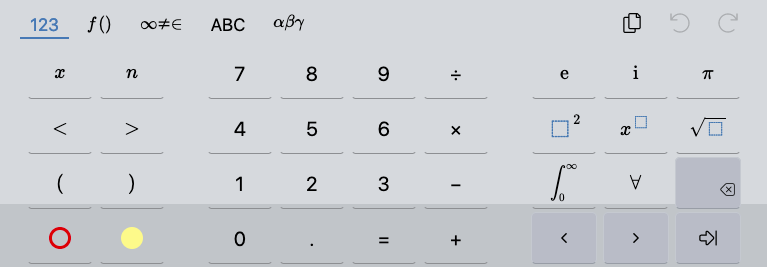

<!-- markdownlint-disable MD033 -->
<!-- markdownlint-disable MD041 -->
<p align="center">
  <a href="https://@TODO.nicolasmura.com" target="_blank">
    
  </a>
</p>

# Mathlive Chat POC

Fullstack monorepo for a simple chat with visual math equations feature powered by mathlive. With Angular frontend and NestJS backend REST API.

- [Mathlive Chat POC](#mathlive-chat-poc)
- [Requirements](#requirements)
- [Quick start](#quick-start)
  - [Run & test locally with Docker](#run--test-locally-with-docker)
  - [Run & test (& dev!) locally without Docker](#run--test--dev-locally-without-docker)
- [Dockerization](#dockerization)
  - [Frontend and backend images for Prod](#frontend-and-backend-images-for-prod)
- [Deploy in a real-world production environment](#deploy-in-a-real-world-production-environment)
- [Unit tests with Jest](#unit-tests-with-jest)
- [End-to-end (e2e) tests with Cypress](#end-to-end-e2e-tests-with-cypress)
- [Interesting stuffs to do / Nice to have](#interesting-stuffs-to-do--nice-to-have)
- [A few words about Nx](#a-few-words-about-nx)
  - [CheatSheet](#cheatsheet)

# Requirements

To contribute to this project and run it locally, you will need:

- [Node JS >= v16.0 & NPM >= 8.1.0](https://nodejs.org/en)
- [Angular 12.x](https://angular.io)
- [Typescript >= 4.3.5](https://www.typescriptlang.org)
- [Docker >= 20.10.11](https://www.docker.com)

> :bulb: **_Tip_**
>
> [Microsoft VS Code editor](https://code.visualstudio.com/) is already packaged with Typescript.

# Quick start

## Run & test locally with Docker

@TODO...

## Run & test (& dev!) locally without Docker

Run:

```bash
  git clone git@github.com:NicolasMura/mathlive-chat-poc.git
  cd mathlive-chat-poc
  # create .env file
  cp .env.example .env
  # install dependencies
  yarn install
```

If needed, adjust environment variables in `apps/frontend-public/src/env.js`

Then, start frontend and backend apps:

```bash
  nx serve frontend-public backend-api
```

Visit `http://localhost:4200` to see the result.

# Dockerization

## Frontend and backend images for Prod

Mandatory server-side files and folders:

* <PROJECT_FOLDER>/config/(dev.)<URL_SITE>-le-ssl-host-proxy.conf
* <PROJECT_FOLDER>/ssl/fullchain.pem
* <PROJECT_FOLDER>/ssl/privkey.pem
* /var/log/<URL_SITE>

```bash
  # mkdir -p .docker/apache_vol/log && mkdir .docker/apache_vol/ssl ??
```

Build locally and push new Docker image for:

`frontend-public`:

```bash
  nx build frontend-public --prod
  docker build -t mlchat-poc-frontend-public -f .docker/Dockerfile.frontend-public .
  docker tag mlchat-poc-frontend-public nicolasmura/mlchat-poc-frontend-public
  docker push nicolasmura/mlchat-poc-frontend-public
  docker tag mlchat-poc-frontend-public nicolasmura/mlchat-poc-frontend-public:v1.0
  docker push nicolasmura/mlchat-poc-frontend-public:v1.0
```

`backend-api`:

```bash
  docker build -t mlchat-poc-backend-api -f .docker/Dockerfile.backend-api .
  docker tag mlchat-poc-backend-api nicolasmura/mlchat-poc-backend-api
  docker push nicolasmura/mlchat-poc-backend-api
  docker tag mlchat-poc-backend-api nicolasmura/mlchat-poc-backend-api:v1.0
  docker push nicolasmura/mlchat-poc-backend-api:v1.0
```

Finally, on server side:

```bash
  docker-compose --env-file .env up -d
```

To get latest images:

```bash
  docker pull nicolasmura/mlchat-poc-frontend-public \
    docker pull nicolasmura/mlchat-poc-backend-api
```

# Deploy in a real-world production environment

> :warning: **_Important_**
>
> On Linux systems with Apache web server, you must set the Apache log folder ownership as following to make it work:
> ```bash
>   sudo chmod 777 .docker/mongodb_vol/log
> ```
>
> Don't worry about that.

Don't forget also to give correct ownership to Apache log folder:

```bash
  sudo chown -R <you>:www-data /var/log/<URL_SITE>
```

# Unit tests with Jest

@TODO

See also https://github.com/molily/angular-form-testing

# End-to-end (e2e) tests with Cypress

@TODO

# Interesting stuffs to do / Nice to have

* Signup form (see https://github.com/molily/angular-form-testing)


# A few words about Nx

🔎 **Powerful, Extensible Dev Tools**

This project was generated using [Nx](https://nx.dev) and below command:

```bash
  npx create-nx-workspace --preset=angular
```

This resulted in following output:

```bash
  Need to install the following packages:
    create-nx-workspace
  Ok to proceed? (y) y
  ✔ Workspace name (e.g., org name)     · mlchat-poc
  ✔ Application name                    · frontend-public
  ✔ Default stylesheet format           · scss
  ✔ Use Nx Cloud? (It's free and doesn't require registration.) · No

  >  NX  Nx is creating your workspace.

    To make sure the command works reliably in all environments, and that the preset is applied correctly,
    Nx will run "npm install" several times. Please wait.

  ✔ Installing dependencies with npm
  ✔ Nx has successfully created the workspace.

  ———————————————————————————————————————————————


  >  NX   NOTE  First time using Nx? Check out this interactive Nx tutorial.

    https://nx.dev/latest/angular/tutorial/01-create-application

    Prefer watching videos? Check out this free Nx course on YouTube.
    https://www.youtube.com/watch?v=2mYLe9Kp9VM&list=PLakNactNC1dH38AfqmwabvOszDmKriGco

  nmura@Nico-MBA-WiFi $
```

Then, after Angular app development, you can start the React equivalent app development with:

```bash
  yarn add -D @nrwl/react
  nx g @nrwl/react:app frontend-public-react
```

Note: to make auto-import from the generic `models` library available to frontend-public-react in VS Code, you will have to install [Nx Console Plugin](https://marketplace.visualstudio.com/items?itemName=nrwl.angular-console).

Visit the [Nx Angular Documentation](https://nx.dev/angular) to learn more.

[10-minute video showing all Nx features](https://nx.dev/angular/getting-started/what-is-nx)

[Interactive Tutorial](https://nx.dev/angular/tutorial/01-create-application)

## CheatSheet

Create `auth` module running the 'module' NestJs generator with Nx project support:

```bash
  nx g @nrwl/nest:module auth --project backend-api --directory app
```

Create `auth` controller running the 'controller' NestJs generator with Nx project support:

```bash
  nx g @nrwl/nest:controller auth --project backend-api --directory app/auth  --flat
```

Create `auth` service inside `auth` module running the 'service' NestJs generator with Nx project support:

```bash
  nx g @nrwl/nest:service auth --project backend-api --directory app/auth --flat
```

Create auth service inside `frontend-tools` Angular library running the 'service' Angular generator with Nx project support:

```bash
  nx g @nrwl/angular:service services/auth --project frontend-tools --flat
```

Create Angular `frontend-tools` and `vendors` libraries:

```bash
  nx g @nrwl/angular:lib frontend-tools
  nx g @nrwl/angular:lib vendors
```

Create `models` global shared lib:

```bash
  npx nx g @nrwl/workspace:lib models
```
